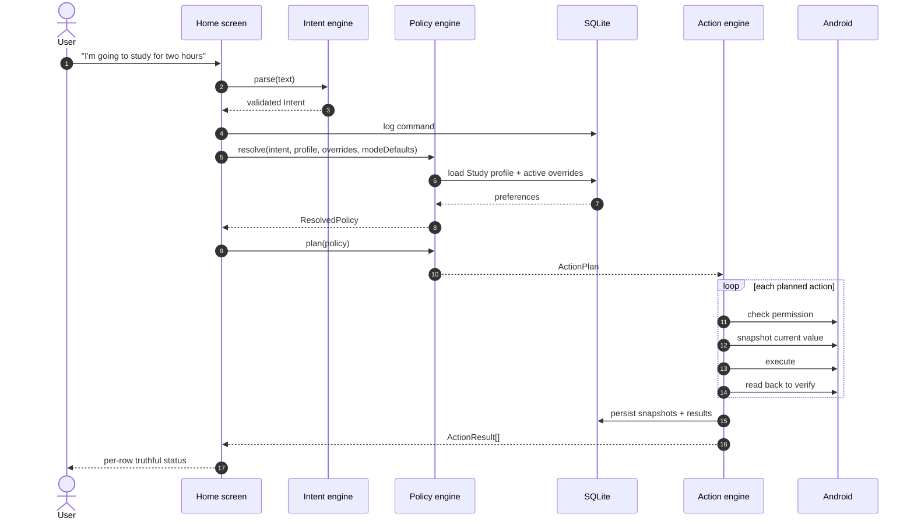
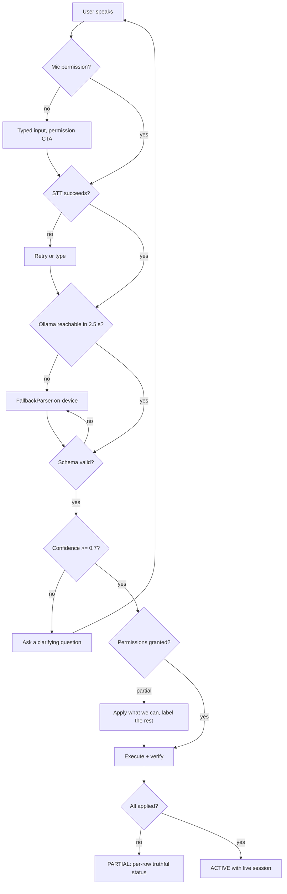

# Ally — Execution Flow

How a spoken sentence becomes a verified change to the phone, and back again.

> **Section ownership.** Each section below has exactly one owner. **Do not edit a section you do
> not own** — that rule is what keeps this file merge-conflict free. Update your section in the
> **same commit** as the code that changed the flow; a phase does not close with this file stale.

| § | Section | Owner |
|---|---|---|
| 1 | Entry points | Aayush |
| 2 | Top-level sequence | Dhrey |
| 3 | Intent pipeline | Shlok |
| 4 | Policy resolution | Dhrey |
| 5 | Action execution | Aayush |
| 6 | Restoration & override expiry | Aayush |
| 7 | Persistence & schema | Dhrey |
| 8 | Bridge / Office Kit | Dhrey |
| 9 | Error & degradation paths | Shlok |

**Status legend:** ✅ implemented · 🚧 in progress · ⬜ contract agreed, not yet built.

---

## 1. Entry points — *Aayush*

⬜ *Phase 1–2. Contract agreed in `src/types/`; implementation pending.*

Four ways into Ally. All converge on the same use case, so nothing is special-cased downstream.

| Entry | Mechanism | Carries parameters? |
|---|---|---|
| App icon | Standard launcher | No |
| "Hey Gemini, open Ally" | System assistant app launch (see ADR-008) | No |
| App Shortcut | Static `ShortcutInfo` — Study / Sleep / End | Yes — mode |
| Deep link | `ally://activate?mode=study&minutes=120` | Yes — mode + duration |
| In-app mic | On-device `SpeechRecognizer`, push-to-talk | Free text |

Parameterised entries skip the intent engine entirely and construct an `Intent` directly with
`source: 'fallback'` and `confidence: 1`. Free text goes through §3.

---

## 2. Top-level sequence — *Dhrey*

⬜ *Phase 2. This is the spine of the product.*



The two horizontal lines in that diagram are the frozen contracts of ADR-006: `Intent` between the
intent engine and the policy engine, `ActionPlan` between the policy engine and the action engine.

---

## 3. Intent pipeline — *Shlok*

✅ *Phase 1–2.*

```
speech ──► on-device STT ──► raw text
                                │
                    ┌───────────┴───────────┐
                    ▼                       ▼
          OllamaClient (LAN)        FallbackParser (on-device)
          POST /parse, 2.5 s              regex + keyword
          JSON-schema constrained         always available
                    │                       │
                    └───────────┬───────────┘
                                ▼
                        IntentValidator (zod)
                     enum-constrained, allow-list only
                                │
                 ┌──────────────┴──────────────┐
                 ▼                             ▼
        confidence ≥ 0.7               confidence < 0.7
        → Intent                       → Clarification
```

**Selection rule.** `src/ai/index.ts` always tries Ollama first with a hard 2.5 s timeout. Any
timeout, transport error, or schema-invalid response falls through to `FallbackParser` silently —
the user sees no error, only a `source` chip reading `ollama` or `fallback`.

**The validator is the security boundary.** Model output is data, never instructions: unknown
capabilities are rejected rather than guessed, values must sit inside `CAPABILITY_DOMAIN`, and no
model output ever reaches an Android API directly (SRS FR-27).

---

## 4. Policy resolution — *Dhrey*

⬜ *Phase 1–2.*

`PolicyEngine.resolve()` is pure TypeScript with no I/O — it takes four inputs and returns a
`ResolvedPolicy`. This makes it fully unit-testable in Node with no device and no database.

**Precedence, highest wins** (SRS FR-11):

```
1. current command      "…and make it 60% today"        → source: 'command'
2. temporary override   "let the group through for 20m" → source: 'override'   (expiresAt honoured)
3. persistent profile   Study → parents always allowed  → source: 'profile'
4. mode default         modes/study.json                → source: 'default'
```

Every resolved entry carries the `source` that won and a human `reason` string, which the UI renders
verbatim under each action row. That provenance is what the Memory screen displays and what answers
the "isn't this just Routines?" question — see ADR-005.

Expired overrides are filtered out **at resolve time**, not by a background job, so the correct
policy is computed even if the app was killed while an override was live.

---

## 5. Action execution — *Aayush*

✅ *Phase 2 — A-V1 landed. `ActionPlan` → `executePlan()` → capability → Android, driven by a
real sentence and verified on SM-S928B. Restore (§6) is still ⬜.*

`executePlan(plan, deps)` walks the `ActionPlan` in order. Per action:

```
in CAPABILITIES? ──no──► ActionResult{ not_supported }   (allow-list, SRS FR-13)
        │yes
        ▼
capability available? ──no──► ActionResult{ not_supported }
        │yes
        ▼
permission granted? ──no──► ActionResult{ permission_needed }   (no mutation attempted)
        │yes
        ▼
needsSnapshot? ──yes──► read current value ──► SnapshotStore.save(sessionId, capability)
        │
        ▼
execute(value)
        │
        ▼
read back ──mismatch──► ActionResult{ failed }
        │match
        ▼
ActionResult{ applied, beforeValue, afterValue }
```

**The executor is handed a device, never reaching for one** (ADR-115). `deps.registry` is a
required `DeviceRegistry`, so `MockDevice` and the Kotlin-backed registry are interchangeable and
the engine unit-tests in Node. Nothing in `src/actions/` parses language, decides policy, or
touches SQLite — `snapshotStoreAdapter.ts` is the single file that knows a database exists, and
the executor does not import it.

**Snapshots go through a port to Dhrey's existing table** (ADR-114). `SnapshotStore` carries the
frozen `DeviceSnapshot` row; `createRepositorySnapshotStore()` wires it to `snapshotRepository`.
`save()` is first-write-wins per `(sessionId, capability)` — re-snapshotting mid-session would
replace the user's original value with one Ally set, and restore would then put back Ally's own
change.

**Ordering is Dhrey's guarantee** (docs/CONTRACTS.md §2), so the executor honours `plan.actions`
order exactly, one at a time, and never reorders or parallelises. For the Study plan the three
actions are independent — DND, brightness and ringer touch unrelated settings — so their order
does not matter; it is still deterministic, because nothing distinguishes that case from a plan
whose actions do interact.

**Progress is not an outcome.** `onProgress` reports `pending | running | settled`; those phases
are deliberately absent from `ACTION_STATUSES`, which only ever holds what happened to the phone.

**The read-back is not optional.** `applied` may only be returned for a write we confirmed by
reading the value again. Everything else is `failed`, `permission_needed` or `not_supported` — this
is the "never fake success" requirement (PRD §20, NFR-03) and the single most load-bearing rule in
the codebase.

One action failing never aborts the plan; the remaining actions still execute and each row reports
its own status independently. `executePlan()` returns exactly one `ActionResult` per
`PlannedAction`, in the same order.

`summarisePlan()` derives the plan-level answer and reports it in the **existing `SessionState`
vocabulary** rather than a new one, because that is what the session layer already expects to be
told (`src/memory/session.ts`: a session starts READY and "the executor moves it to ACTIVE once
actions are applied"):

| every action applied | some applied | none applied |
|---|---|---|
| `ACTIVE` | `PARTIAL` | `ERROR` |

The executor **returns** that state; it never writes it. Moving the session row is
`markSessionActive()` / `endSession()` in Dhrey's memory layer.

**A-V1 on the real device** (SM-S928B, Android 16, targetSdk 36). Driven by
`activateFromText("I'm going to study for two hours.")` — a real plan from the real producer, no
fixture. Read independently via `adb shell settings`:

| | before | after |
|---|---|---|
| `global zen_mode` | 0 | 1 (priority) |
| `system screen_brightness` | 187 | 102 (40%) |

Executor reported `PARTIAL — 2/3 applied`: `dnd: applied [interruption_filter]`,
`brightness: applied`, `ringer: not_supported`. The ringer row is correct and expected — `ringer`
is still `pendingCapability` until T5 (ADR-104), so a Study plan cannot be 3/3 until then, and
`PARTIAL` is the honest answer rather than a rounded success or failure. Snapshots for `dnd`
("off") and `brightness` (73) landed in `device_snapshot`; `ringer` correctly produced none,
because an action that never ran has nothing to restore.

### 5.1 A remembered preference, on the device side — *Aayush, Phase 4*

Nothing in the execution path changed for Phase 4, and that is the finding rather than a shortfall.
A value the user taught Ally and a value from `study.json` arrive as the same `PlannedAction`, and
the executor is not told which is which — the precedence was already settled upstream:

```
preference row            (Dhrey — profileRepository)
      ↓  loadProfileContext()
      ↓  resolve()        command > override > profile > default   (Dhrey)
      ↓  buildActionPlan() → PlannedAction{ value, reason }        (Dhrey)
      ↓  ─────────────── contract boundary 2 ───────────────
      ↓  startContext()                                            (AAYUSH from here)
      ↓  snapshot → apply → read back
      ↓  Android
```

**The executor deliberately cannot tell a taught value from a default.** If it could, it would be
deciding policy, and there would be two places that know what the user prefers. `resolve()` is the
only one.

**What DID have to change is provenance** (ADR-126). `ResolvedEntry.source` and `entry.reason`
already carried "where did this come from", and `buildActionPlan()` copies the sentence onto every
`PlannedAction` — then it stopped, because `ActionResult` has no field for it and is frozen. So the
moment the executor turned a planned action into an outcome, the answer to *why is my phone like
this* was gone. `explainResults(plan, results)` pairs them back up positionally,
`startContext()` returns it as `explained`, and the Active Context screen renders it under each
row. Derived on demand, never stored, sentences copied verbatim.

**Priority does not travel as a `PlannedAction`, and cannot.** "Mom can call me during Study" is
not a capability value — Android has no per-contact Do Not Disturb exception, so it is a rewrite of
`NotificationManager.Policy`, which the frozen `CAPABILITIES` list has no member for. It reaches
the device through the lifecycle's injected `applyPriority` thunk (ADR-119), after the plan and
never when the plan applied nothing. Restoring it is §6.

**Removing a preference needs no device-side work at all.** The next activation simply resolves
without it, because nothing on this side of the boundary caches what the user prefers.

**Mid-context changes are NOT defined by any interface, and Phase 4 does not invent them.**
`resolve()` is called from exactly one place, `activateFromText`, which also calls `startSession` —
so resolving and starting a context are the same act, and there is no way to re-resolve against a
running session. The frozen `SESSION_STATES` contains `OVERRIDING` and nothing sets it. Shlok's
parser already emits `operation: 'modify'` and consults `ctx.activeActivity` to choose it; nothing
consumes either. The one thing the device layer can say about it today is a warning:

| expressing the change as… | what the snapshot ends up holding |
|---|---|
| another run on the **same** `sessionId` | the user's original — first-write-wins protects it |
| a fresh `activateFromText()` | **the value Ally set**, recorded as if it were the user's |

The second row is a live trap: re-activating starts a *second* session, `getActiveContext()`
returns the new one, and the genuine original is stranded on a first session nothing will ever end.
Both rows are pinned by tests in `src/actions/__tests__/learnedPreferences.test.ts`.

### 5.2 Sleep and the wake-up alarm — *Aayush, Phase 5*

```
"I'm going to sleep. Wake me at 7 AM on weekdays."
      |  Shlok    intent.schedule = { kind: 'weekdays', time: '07:00' }
      |  Dhrey    resolve() -> entry(alarm, '07:00', source: command)
      |  Dhrey    alarmRepository.createAlarmMetadata({ time, recurrence })
      |  Dhrey    buildActionPlan() -> [dnd, brightness, alarm 07:00, alarm 07:00]
      |  ----------------- contract boundary 2 -----------------
      |  AAYUSH   withAlarmContext(device, { recurrence, sessionId })
      |           startContext() -> ActionExecutor -> AlarmCapability
      |           ACTION_SET_ALARM  (EXTRA_HOUR/MINUTES/MESSAGE/SKIP_UI[/DAYS])
      |  Android  com.sec.android.app.clockpackage
                  -> the alarm exists in the STOCK Clock
```

**AlarmClock, not AlarmManager** (ADR-127). An `AlarmManager` alarm belongs to Ally: invisible in
the Clock, gone with the app's data, uneditable by the user. Phase 5 asks for a real alarm, so
Android owns it the moment the intent is sent. The permission follows — `SET_ALARM`, not
`SCHEDULE_EXACT_ALARM`.

**`applied` is narrowed, out loud.** There is no public read-back for Clock alarms, so `applied`
means a real Clock activity resolved and accepted the intent — nothing more — and the message says
"Sent to your Clock app". The acceptance evidence is a human opening the Clock.

**Two things the plan cannot carry, supplied by the shell.** `PlannedAction.value` is a string, so
"Wake me at 7 AM." and "Wake me at 7 AM on weekdays." produce byte-identical actions. The shell
already holds `intent.schedule.kind` and `plan.sessionId`, so it binds both to the capability and
hands the registry in (ADR-115). Recurrence is never inferred: no context means one-shot, and
`EXTRA_DAYS` is not sent at all.

**The plan asks for the alarm twice.** Shlok puts it in `requestedChanges` (so it resolves as a
`command` entry) and `buildActionPlan` appends a second from `schedule`. The second identical
request reports `skipped` and sends nothing, so one sentence produces one alarm. `summarisePlan()`
counts `skipped` as settled for this reason — otherwise a flawless Sleep run would report PARTIAL.

**The alarm is NOT part of restoration** (section 6). `snapshot()` is null and `restore()` is
`skipped`: Sleep ends when the user wakes up, and deleting their 7am alarm at that moment would
take tomorrow's with it. Restoration returns what Ally borrowed, and Ally never borrowed the alarm.

**Cancellation is BLOCKED upstream and LIMITED downstream.** No ActionPlan can express it —
"Cancel the wake-up alarm." yields `operation: modify`, `schedule.kind: none`, and a plan with no
alarm action — so the native dismissal exists as a standalone function waiting to be wired. And on
the SM-S928B `ACTION_DISMISS_ALARM` does not remove a scheduled alarm at all (ADR-127), so it
reports "accepted", not "dismissed".

---

## 6. Restoration & override expiry — *Aayush*

✅ *Phase 2 — A-V2 landed: `restoreSession()` puts the device back, exactly, across process
death. Override expiry is still ⬜ Phase 3.*

**Ending a context:**

```
"I'm done studying"
   → read the session from SQLite (NOT from React state — it may not exist any more)
   → load DeviceSnapshot rows for the session
   → restore in LIFO order (reverse of application)
   → verify each restore by read-back
   → summariseRestore() ⇒ IDLE (clean) | PARTIAL (anything less)
   → clean ⇒ caller may clear the rows;  otherwise they are RETAINED for retry
   → caller calls endSession(sessionId, { status })
```

`restoreSession(sessionId, deps)` is driven **entirely by persisted snapshots**, never by
recomputing "what Study probably changed". A capability that never executed wrote no row, so it
is never restored and nothing has to special-case it — `ringer` reporting `not_supported` at
apply time simply does not appear at restore time.

**LIFO, with ties settled deliberately** (ADR-117). Capture order is application order, because
the executor snapshots immediately before each write, so reversing the stored array is the
reverse of application. `capturedAt` is a millisecond clock, though, and two captures in the same
millisecond compare equal — reachable any time a test injects a frozen clock. So `lifoOrder()`
reverses first and then applies a *stable* sort: equal timestamps keep reverse-storage order
rather than falling back to whatever the database happened to return. Ordering is never left to
chance.

**One failure never aborts the walk.** A phone that refuses to put brightness back must still get
its Do Not Disturb turned off.

**DND gives back two things, not one** (ADR-120). The interruption filter is the visible half; the
`NotificationManager.Policy` Ally rewrites to express "let Mom call me" is the other, and it is
just as much borrowed state. `DndCapability.restore()` puts the policy back first, then the filter
on top of it, and the policy goes back whenever one was saved — never conditional on which mode is
being returned to, which is what used to strand a user who already had Do Not Disturb on. The
saved copy lives in SharedPreferences with all five policy fields, so it survives the process, and
is cleared only once a read-back confirms the restore.

**The two sequences are one call each** (ADR-118). `startContext(plan, deps)` and
`endContext(sessionId, deps)` in `ContextCoordinator.ts` compose `executePlan()` and
`restoreSession()` — they re-implement neither, and own no policy, session table or persistence.
Each carries a rule that is easy to get quietly wrong and now has tests on it: never report
ACTIVE when nothing applied, and never drop the snapshots after a restore that only half-worked.

```
READY ──startContext(plan)──► ACTIVE | PARTIAL | ERROR
                                   └──endContext(sessionId)──► IDLE | PARTIAL
```

Every value is an existing `SessionState`. `endContext()` needs nothing but a `sessionId`, which
is what lets it run on a process that never saw the plan.

**The session boundary is a hook, not a call.** Moving a session row is Dhrey's
`markSessionActive()` / `endSession()`, and those are database writes this layer must not make.
The coordinator fires `onStarted` / `onActivated` / `onFailed` / `onPartial` / `onEnded` and the
caller connects them; `app/src/actions/` never imports `src/memory`. A caller that wires nothing
still gets correct device behaviour, and a hook that throws is contained — a session row that
failed to update must never make a device change that already happened look like it did not.

`onPartial` fires on the RESTORE path only. It originally fired for a partly-applied plan too,
and that cost an afternoon on the device: the harness wires it to `endSession()`, so a PARTIAL
apply immediately ended the session it had just started and the next `endContext()` reported "no
active context to end". A partial apply is already fully described by `onActivated(id, 'PARTIAL')`.

**Priority rides the lifecycle, but is not in the plan** (ADR-119). Who may still reach the user
is resolved by Dhrey's `applyPriorityForContext()` and sent to Android by
`applyPriorityPreferences()`; `startContext()` takes that as an injected thunk and only decides
WHEN — after the plan, and never when the plan applied nothing, because a context that never
started must not rewrite the user's notification policy. The result comes back as
`ChannelEnforcement[]` in its own four-state vocabulary and is deliberately NOT folded into the
plan's status: "the context is active" and "your WhatsApp preference is remembered but Android
will not act on it" are different facts and the user needs both.

**Emergency detection is a reader on the same lifecycle** (ADR-122). `evaluateEmergency()` wraps
the existing `CallLogAnalyzer` — same caller, 4+ calls, rolling 10 minutes, all of it still in
Kotlin — and is called on demand from the Active Context screen. It writes nothing, adds nobody to
Priority, and never touches a snapshot: a detection is an observation, not a change. An unreadable
call log comes back `ok: false` with a reason rather than `detected: false`, because "we could not
look" is not "nobody called". Ally reports the condition; Android decides whether the call rings.

**Where the user sees all this** (ADR-121). `startContext()` leads to an Active Context screen
showing the mode, ACTIVE vs PARTIAL, the remaining time, every action in its own truthful status,
who can still reach the user, and the way out. The session is re-read from the database on every
visit, so the screen is correct on a process that never applied anything — which is the same
reason `endContext()` needs only a sessionId. Every status renders through `STATUS_PRESENTATION`
or `ENFORCEMENT_PRESENTATION`, so no screen can round `not_supported` up to a failure or `PARTIAL`
up to a success.


**Snapshots are retained unless the restore was clean.** `restoreSession()` never deletes
anything — that is a database write this layer must not perform, and the rows *are* the retry.
The caller reads `summariseRestore().safeToClear` and calls `SnapshotStore.clear()` only on a
clean sweep. A retry after the user re-grants a permission finishes the job exactly.

Capabilities with no restorable prior state — the alarm — return `skipped` rather than being
"un-set". An alarm the user asked for is not collateral of the context, so `skipped` counts as a
clean outcome.

**Exactness survives the process dying** (ADR-116). The contract carries brightness as a percent,
but Android stores a raw 0..255 value and `raw → percent → raw` loses up to a unit: 187 reports as
73%, and 73% converts back to 186. `BrightnessController` therefore keeps the exact raw value and
the user's original brightness mode in **SharedPreferences**, written with `commit()` rather than
`apply()`, because the scenario being defended against is the process dying before an async flush
lands. A context routinely outlives its process — start Study, Android kills the app, reopen an
hour later and end it — and an in-heap cache is empty by then. The percent conversion remains only
as a genuine last resort, and `brightnessRestore()` reports `exact: false` when it had to use it.

**Override expiry** is evaluated lazily at resolve time (§4) and surfaced by a scheduled local
notification for the user-visible countdown. No always-on background service (NFR-09).

---

## 7. Persistence & schema — *Dhrey*

⬜ *Phase 1.*

SQLite via `expo-sqlite`, local-only. No cloud, no accounts, no sync (PRD §21).

```
context_profile ─┬─< preference           (capability, value, source, sourceCommand)
                 ├─< temporary_override   (subject, effect, startAt, expiresAt, active)
                 └─< context_session ─┬─< device_snapshot   (capability, previousValue)
                                      └─< action_execution  (status, before/after)
command_log      (rawText, intentJson, confidence, source)
permission_state (key, granted, checkedAt)
```

`preference.sourceCommand` stores the verbatim sentence that created the preference. It is what lets
the Memory screen say *"because you said 'let my parents call me' on Aug 29"* — do not drop it when
optimising writes.

`device_snapshot` is the restoration source of truth (§6). Rows are kept until a successful restore
so a partial failure remains recoverable.

---

## 8. Bridge / Office Kit — *Dhrey*

⬜ *Phase 6.*

One Node/TypeScript process on the laptop serving two unrelated jobs:

| Route | Owner | Purpose |
|---|---|---|
| `POST /parse` | Shlok | Ollama proxy with JSON-schema constrained output (§3) |
| `POST /session` | Dhrey | Phone pushes session events, fire-and-forget |
| `GET /dashboard` | Dhrey | Live companion view, sized for a mirrored laptop screen |
| `GET /health` | Shlok | Drives the "local AI connected" chip |

Transport at demo time is `adb reverse tcp:11434 tcp:11434` over USB, never venue Wi-Fi.

**Every bridge call is optional by contract.** `POST /session` is fire-and-forget and must never
block the UI, show a spinner, or raise a dialog. A dead bridge degrades the laptop view only; the
phone is fully functional standalone.

---

## 9. Error & degradation paths — *Shlok*

✅ *Phase 1–3.*

The system degrades in layers. Each layer failing costs a capability, never the product.



| Failure | Behaviour |
|---|---|
| No network / Ollama down | `FallbackParser`; golden path unaffected; chip reads `fallback` |
| Schema-invalid model output | Discarded, fall through to `FallbackParser` — never partially trusted |
| Low confidence | Clarifying question, never a guess (SRS FR-21) |
| Ambiguous contact | Ask which contact; never resolve by guessing |
| Permission missing | That capability only is `permission_needed`; the rest still apply |
| Capability unsupported by OEM | `not_supported`; never faked |
| Restore fails | Session marked `PARTIAL`; snapshots retained for retry |
| App killed mid-session | Session and snapshots reload from SQLite; resume or end offered (NFR-06) |
| Bridge down | Laptop view stops updating; phone unaffected |
