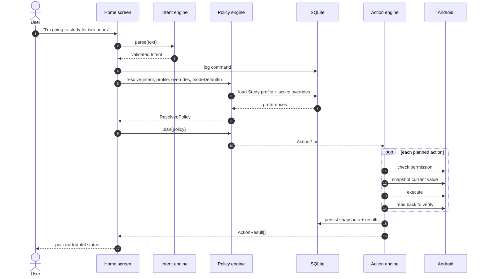
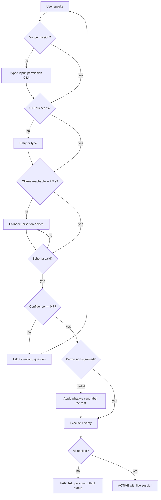

# Ally — Execution Flow

How a spoken sentence becomes a verified change to the phone, and back again.

> **Section ownership.** Each section below has exactly one owner. **Do not edit a section you do
> not own** — that rule is what keeps this file merge-conflict free. Update your section in the
> **same commit** as the code that changed the flow; a phase does not close with this file stale.

| § | Section | Owner |
|---|---|---|
| 1 | Entry points | Aayush |
| 2 | Top-level sequence | Dhrey |
| 3 | Intent pipeline | Shlok |
| 4 | Policy resolution | Dhrey |
| 5 | Action execution | Aayush |
| 6 | Restoration & override expiry | Aayush |
| 7 | Persistence & schema | Dhrey |
| 8 | Bridge / Office Kit | Dhrey |
| 9 | Error & degradation paths | Shlok |

**Status legend:** ✅ implemented · 🚧 in progress · ⬜ contract agreed, not yet built.

---

## 1. Entry points — *Aayush*

⬜ *Phase 1–2. Contract agreed in `src/types/`; implementation pending.*

Four ways into Ally. All converge on the same use case, so nothing is special-cased downstream.

| Entry | Mechanism | Carries parameters? |
|---|---|---|
| App icon | Standard launcher | No |
| "Hey Gemini, open Ally" | System assistant app launch (see ADR-008) | No |
| App Shortcut | Static `ShortcutInfo` — Study / Sleep / End | Yes — mode |
| Deep link | `ally://activate?mode=study&minutes=120` | Yes — mode + duration |
| In-app mic | On-device `SpeechRecognizer`, push-to-talk | Free text |

Parameterised entries skip the intent engine entirely and construct an `Intent` directly with
`source: 'fallback'` and `confidence: 1`. Free text goes through §3.

---

## 2. Top-level sequence — *Dhrey*

⬜ *Phase 2. This is the spine of the product.*



The two horizontal lines in that diagram are the frozen contracts of ADR-006: `Intent` between the
intent engine and the policy engine, `ActionPlan` between the policy engine and the action engine.

---

## 3. Intent pipeline — *Shlok*

✅ *Phase 1–2.*

```
speech ──► on-device STT ──► raw text
                                │
                    ┌───────────┴───────────┐
                    ▼                       ▼
          OllamaClient (LAN)        FallbackParser (on-device)
          POST /parse, 2.5 s              regex + keyword
          JSON-schema constrained         always available
                    │                       │
                    └───────────┬───────────┘
                                ▼
                        IntentValidator (zod)
                     enum-constrained, allow-list only
                                │
                 ┌──────────────┴──────────────┐
                 ▼                             ▼
        confidence ≥ 0.7               confidence < 0.7
        → Intent                       → Clarification
```

**Selection rule.** `src/ai/index.ts` always tries Ollama first with a hard 2.5 s timeout. Any
timeout, transport error, or schema-invalid response falls through to `FallbackParser` silently —
the user sees no error, only a `source` chip reading `ollama` or `fallback`.

**The validator is the security boundary.** Model output is data, never instructions: unknown
capabilities are rejected rather than guessed, values must sit inside `CAPABILITY_DOMAIN`, and no
model output ever reaches an Android API directly (SRS FR-27).

---

## 4. Policy resolution — *Dhrey*

⬜ *Phase 1–2.*

`PolicyEngine.resolve()` is pure TypeScript with no I/O — it takes four inputs and returns a
`ResolvedPolicy`. This makes it fully unit-testable in Node with no device and no database.

**Precedence, highest wins** (SRS FR-11):

```
1. current command      "…and make it 60% today"        → source: 'command'
2. temporary override   "let the group through for 20m" → source: 'override'   (expiresAt honoured)
3. persistent profile   Study → parents always allowed  → source: 'profile'
4. mode default         modes/study.json                → source: 'default'
```

Every resolved entry carries the `source` that won and a human `reason` string, which the UI renders
verbatim under each action row. That provenance is what the Memory screen displays and what answers
the "isn't this just Routines?" question — see ADR-005.

Expired overrides are filtered out **at resolve time**, not by a background job, so the correct
policy is computed even if the app was killed while an override was live.

---

## 5. Action execution — *Aayush*

✅ *Phase 2 — A-V1 landed. `ActionPlan` → `executePlan()` → capability → Android, driven by a
real sentence and verified on SM-S928B. Restore (§6) is still ⬜.*

`executePlan(plan, deps)` walks the `ActionPlan` in order. Per action:

```
in CAPABILITIES? ──no──► ActionResult{ not_supported }   (allow-list, SRS FR-13)
        │yes
        ▼
capability available? ──no──► ActionResult{ not_supported }
        │yes
        ▼
permission granted? ──no──► ActionResult{ permission_needed }   (no mutation attempted)
        │yes
        ▼
needsSnapshot? ──yes──► read current value ──► SnapshotStore.save(sessionId, capability)
        │
        ▼
execute(value)
        │
        ▼
read back ──mismatch──► ActionResult{ failed }
        │match
        ▼
ActionResult{ applied, beforeValue, afterValue }
```

**The executor is handed a device, never reaching for one** (ADR-115). `deps.registry` is a
required `DeviceRegistry`, so `MockDevice` and the Kotlin-backed registry are interchangeable and
the engine unit-tests in Node. Nothing in `src/actions/` parses language, decides policy, or
touches SQLite — `snapshotStoreAdapter.ts` is the single file that knows a database exists, and
the executor does not import it.

**Snapshots go through a port to Dhrey's existing table** (ADR-114). `SnapshotStore` carries the
frozen `DeviceSnapshot` row; `createRepositorySnapshotStore()` wires it to `snapshotRepository`.
`save()` is first-write-wins per `(sessionId, capability)` — re-snapshotting mid-session would
replace the user's original value with one Ally set, and restore would then put back Ally's own
change.

**Ordering is Dhrey's guarantee** (docs/CONTRACTS.md §2), so the executor honours `plan.actions`
order exactly, one at a time, and never reorders or parallelises. For the Study plan the three
actions are independent — DND, brightness and ringer touch unrelated settings — so their order
does not matter; it is still deterministic, because nothing distinguishes that case from a plan
whose actions do interact.

**Progress is not an outcome.** `onProgress` reports `pending | running | settled`; those phases
are deliberately absent from `ACTION_STATUSES`, which only ever holds what happened to the phone.

**The read-back is not optional.** `applied` may only be returned for a write we confirmed by
reading the value again. Everything else is `failed`, `permission_needed` or `not_supported` — this
is the "never fake success" requirement (PRD §20, NFR-03) and the single most load-bearing rule in
the codebase.

One action failing never aborts the plan; the remaining actions still execute and each row reports
its own status independently. `executePlan()` returns exactly one `ActionResult` per
`PlannedAction`, in the same order.

`summarisePlan()` derives the plan-level answer and reports it in the **existing `SessionState`
vocabulary** rather than a new one, because that is what the session layer already expects to be
told (`src/memory/session.ts`: a session starts READY and "the executor moves it to ACTIVE once
actions are applied"):

| every action applied | some applied | none applied |
|---|---|---|
| `ACTIVE` | `PARTIAL` | `ERROR` |

The executor **returns** that state; it never writes it. Moving the session row is
`markSessionActive()` / `endSession()` in Dhrey's memory layer.

**A-V1 on the real device** (SM-S928B, Android 16, targetSdk 36). Driven by
`activateFromText("I'm going to study for two hours.")` — a real plan from the real producer, no
fixture. Read independently via `adb shell settings`:

| | before | after |
|---|---|---|
| `global zen_mode` | 0 | 1 (priority) |
| `system screen_brightness` | 187 | 102 (40%) |

Executor reported `PARTIAL — 2/3 applied`: `dnd: applied [interruption_filter]`,
`brightness: applied`, `ringer: not_supported`. The ringer row is correct and expected — `ringer`
is still `pendingCapability` until T5 (ADR-104), so a Study plan cannot be 3/3 until then, and
`PARTIAL` is the honest answer rather than a rounded success or failure. Snapshots for `dnd`
("off") and `brightness` (73) landed in `device_snapshot`; `ringer` correctly produced none,
because an action that never ran has nothing to restore.

---

## 6. Restoration & override expiry — *Aayush*

✅ *Phase 2 — A-V2 landed: `restoreSession()` puts the device back, exactly, across process
death. Override expiry is still ⬜ Phase 3.*

**Ending a context:**

```
"I'm done studying"
   → read the session from SQLite (NOT from React state — it may not exist any more)
   → load DeviceSnapshot rows for the session
   → restore in LIFO order (reverse of application)
   → verify each restore by read-back
   → summariseRestore() ⇒ IDLE (clean) | PARTIAL (anything less)
   → clean ⇒ caller may clear the rows;  otherwise they are RETAINED for retry
   → caller calls endSession(sessionId, { status })
```

`restoreSession(sessionId, deps)` is driven **entirely by persisted snapshots**, never by
recomputing "what Study probably changed". A capability that never executed wrote no row, so it
is never restored and nothing has to special-case it — `ringer` reporting `not_supported` at
apply time simply does not appear at restore time.

**LIFO, with ties settled deliberately** (ADR-117). Capture order is application order, because
the executor snapshots immediately before each write, so reversing the stored array is the
reverse of application. `capturedAt` is a millisecond clock, though, and two captures in the same
millisecond compare equal — reachable any time a test injects a frozen clock. So `lifoOrder()`
reverses first and then applies a *stable* sort: equal timestamps keep reverse-storage order
rather than falling back to whatever the database happened to return. Ordering is never left to
chance.

**One failure never aborts the walk.** A phone that refuses to put brightness back must still get
its Do Not Disturb turned off.

**Snapshots are retained unless the restore was clean.** `restoreSession()` never deletes
anything — that is a database write this layer must not perform, and the rows *are* the retry.
The caller reads `summariseRestore().safeToClear` and calls `SnapshotStore.clear()` only on a
clean sweep. A retry after the user re-grants a permission finishes the job exactly.

Capabilities with no restorable prior state — the alarm — return `skipped` rather than being
"un-set". An alarm the user asked for is not collateral of the context, so `skipped` counts as a
clean outcome.

**Exactness survives the process dying** (ADR-116). The contract carries brightness as a percent,
but Android stores a raw 0..255 value and `raw → percent → raw` loses up to a unit: 187 reports as
73%, and 73% converts back to 186. `BrightnessController` therefore keeps the exact raw value and
the user's original brightness mode in **SharedPreferences**, written with `commit()` rather than
`apply()`, because the scenario being defended against is the process dying before an async flush
lands. A context routinely outlives its process — start Study, Android kills the app, reopen an
hour later and end it — and an in-heap cache is empty by then. The percent conversion remains only
as a genuine last resort, and `brightnessRestore()` reports `exact: false` when it had to use it.

**Override expiry** is evaluated lazily at resolve time (§4) and surfaced by a scheduled local
notification for the user-visible countdown. No always-on background service (NFR-09).

---

## 7. Persistence & schema — *Dhrey*

⬜ *Phase 1.*

SQLite via `expo-sqlite`, local-only. No cloud, no accounts, no sync (PRD §21).

```
context_profile ─┬─< preference           (capability, value, source, sourceCommand)
                 ├─< temporary_override   (subject, effect, startAt, expiresAt, active)
                 └─< context_session ─┬─< device_snapshot   (capability, previousValue)
                                      └─< action_execution  (status, before/after)
command_log      (rawText, intentJson, confidence, source)
permission_state (key, granted, checkedAt)
```

`preference.sourceCommand` stores the verbatim sentence that created the preference. It is what lets
the Memory screen say *"because you said 'let my parents call me' on Aug 29"* — do not drop it when
optimising writes.

`device_snapshot` is the restoration source of truth (§6). Rows are kept until a successful restore
so a partial failure remains recoverable.

---

## 8. Bridge / Office Kit — *Dhrey*

⬜ *Phase 6.*

One Node/TypeScript process on the laptop serving two unrelated jobs:

| Route | Owner | Purpose |
|---|---|---|
| `POST /parse` | Shlok | Ollama proxy with JSON-schema constrained output (§3) |
| `POST /session` | Dhrey | Phone pushes session events, fire-and-forget |
| `GET /dashboard` | Dhrey | Live companion view, sized for a mirrored laptop screen |
| `GET /health` | Shlok | Drives the "local AI connected" chip |

Transport at demo time is `adb reverse tcp:11434 tcp:11434` over USB, never venue Wi-Fi.

**Every bridge call is optional by contract.** `POST /session` is fire-and-forget and must never
block the UI, show a spinner, or raise a dialog. A dead bridge degrades the laptop view only; the
phone is fully functional standalone.

---

## 9. Error & degradation paths — *Shlok*

✅ *Phase 1–3.*

The system degrades in layers. Each layer failing costs a capability, never the product.



| Failure | Behaviour |
|---|---|
| No network / Ollama down | `FallbackParser`; golden path unaffected; chip reads `fallback` |
| Schema-invalid model output | Discarded, fall through to `FallbackParser` — never partially trusted |
| Low confidence | Clarifying question, never a guess (SRS FR-21) |
| Ambiguous contact | Ask which contact; never resolve by guessing |
| Permission missing | That capability only is `permission_needed`; the rest still apply |
| Capability unsupported by OEM | `not_supported`; never faked |
| Restore fails | Session marked `PARTIAL`; snapshots retained for retry |
| App killed mid-session | Session and snapshots reload from SQLite; resume or end offered (NFR-06) |
| Bridge down | Laptop view stops updating; phone unaffected |
